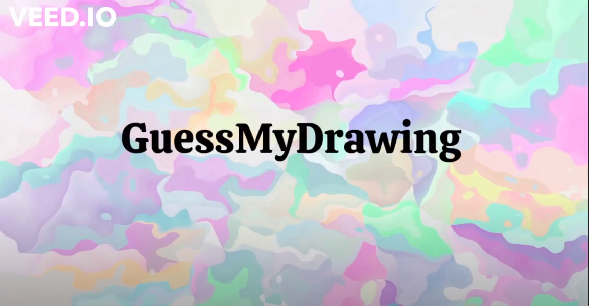

# Project GuessMyDrawing

GuessMyDrawing is an online multiplayer game that consists of one player(host) drawing and other players guessing. When a player guesses the term that the host was drawing that player becomes the next host and the game continues.

## Demo video

[](https://drive.google.com/file/d/1ec5mNiGc0yYUiZQ0u1JVkge6lPBNUKoz/view?usp=sharing)

## Build

``` bash
git clone https://gitlab.com/matf-bg-ac-rs/course-rs/projects-2021-2022/07-GuessMyDrawing.git 
cd 07-GuessMyDrawing/07-GuessMyDrawing
mkdir build
cd build 
qmake ..
make
```

## Run

- Starting the server:

``` bash
./Server/Server
```

- Starting the game:

``` bash
./Application/Application
```

## Testing

- Requirement: Download catch.hpp library 
- After build go to tests dir and then run:
``` bash
qmake
make
./test
```

## Developers

- [Jelena Bondžić, 131/2018](https://gitlab.com/JelenaBondzic)
- [Milica Gnjatović, 18/2018](https://gitlab.com/milicagnjatovic18)
- [Tijana Živković, 66/2018](https://gitlab.com/tijanazivkovic)
- [Isidora Slavković, 30/2018](https://gitlab.com/IsidoraSlavkovic)
